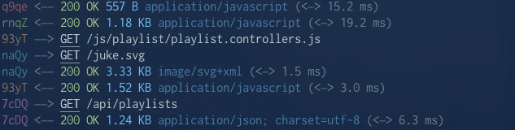

# Asyncview

### A tiny Express middleware for logging async requests and responses

```js
const express = require('express')
const asyncview = require('asyncview')

const app = express()
app.use(asyncview)
```



`asyncview` is a lightweight middleware based on Connect.  
It logs every incoming request and the corresponding response as separate events.  
If desired, it can also integrate with the [`debug`](https://github.com/visionmedia/debug#readme) module.

## What's the reason for it?

There are several ways to log HTTP traffic, but each has its trade-offs:

* **Logging on request only** → You won't see what the server sends back.
* **Logging on response only** → Two downsides:  
  * If the response is never sent, the request will remain unlogged.  
  * Requests and responses are mixed together and lose their timeline clarity.
* **Logging both request and response** → This is clearer, but it needs a way to link them together.

`asyncview` solves this by assigning a random ID to each request–response pair.  
This makes it a great tool for:

* Debugging projects during development
* Explaining async behavior to students
* Quickly troubleshooting HTTP issues without extra setup

## Getting started

### Install vin npm

1. `npm install asyncview` # Deprecated: so use build instead

### Build from sources

1. `git clone https://github.com/shinbatsu/asyncview.git && cd asyncview`
2. `npm install`
3. `npm run build`
4. `npm link asyncview`


### Usage

The simplest way to use it:

```js
const app = require('express')()
const asyncview = require('asyncview')

app.use(asyncview) // starts logging
```

By default, it writes logs to `process.stdout`.

### `asyncview.custom(config)`

If you need more control, you can create a custom logger:

```js
const logger = asyncview.custom({ debug: true }) // uses namespace 'http'
// const logger = asyncview.custom({ debug: 'custom-namespace' })
// const logger = asyncview.custom({ debug: debugInstance })

app.use(logger)
```

The `debug` option works with the [`debug`](https://github.com/visionmedia/debug#readme) module:

| value      | behavior                                                                                                      |
| ---------- | ------------------------------------------------------------------------------------------------------------ |
| `true`     | creates a debug instance with the default namespace `'http'`                                                |
| `string`   | creates a debug instance using the given namespace                                                          |
| `function` | uses any custom function (for example, an existing debug instance). It will be called with colorized output |
